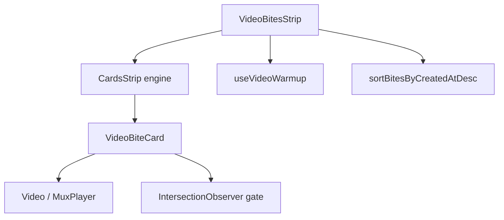

<!-- source-hash: f6cb5509048904127db3df5bae07f87b -->
Brief description: `video-bites-strip.tsx` is the unified public video-bites surface component that renders a horizontally scrolling marquee strip of video preview cards with hover-activated muted autoplay, built on the shared `CardsStrip` engine.

## Key Components

### `VideoBitesStrip`
The main section-level component. Filters and sorts bites by publish status and creation date, warms up Mux/Supabase origins, and delegates rendering to `CardsStrip` via render-prop.

### `VideoBiteCard`
The individual card component, exported for reuse in the admin bites editor. Manages:
- Hover activation (controlled by strip or self-managed standalone)
- Player mount gating via a two-way `IntersectionObserver` (~500px root margin) to bound live `MuxPlayer` instances to the visible strip width
- Rendition-capped preview URLs via `toMuxPreviewUrl` (720p cap for HLS)
- Overlay navigation (anchor or button depending on `href` vs `onNavigate`)

### Key Types
- **`VideoBiteStripItem`** — extends `VideoTeaserWithRatio` with per-bite `profile`, `href`, and `onNavigate`
- **`VideoBitesStripProps`** — section-level config: bites array, title, scroll behavior, card dimensions, chevrons
- **`VideoBiteCardProps`** — card-level config: controlled vs. self-managed hover/mount, toolbar slot, inline title editing

## Usage Example

```typescript
import { VideoBitesStrip } from './video-bites-strip';

// Section-level strip (typical public page usage)
<VideoBitesStrip
  bites={bites}
  title="Key Moments"
  profile={{ name: 'Acme Corp', avatarUrl: '/logo.png' }}
  href="/entity/acme"
  autoScroll
  autoScrollSpeed={60}
  cardHeightDesktop={416}
  cardHeightMobile={300}
/>

// Standalone card (admin editor — self-managed hover/mount)
import { VideoBiteCard } from './video-bites-strip';

<VideoBiteCard
  bite={bite}
  index={0}
  profile={profile}
  toolbar={<AdminToolbar />}
  titleEditable
  onTitleCommit={handleTitleSave}
/>
```

## Architecture Notes



**Source:** [`video-bites-strip.tsx`](https://github.com/flamingo-stack/openframe-oss-lib/blob/main/video-bites-strip.tsx)