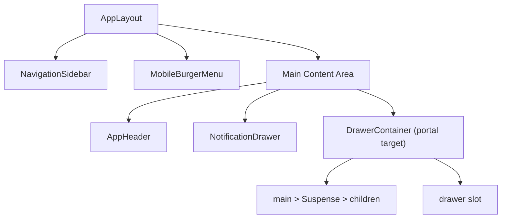

<!-- source-hash: bb05b41e1eb3c487eae308af423755ac -->
Provides the root application shell that composes the sidebar, header, mobile menu, notification drawer, and a portal-target container for layout-level drawers into a single responsive layout.

## Key Components

| Export | Type | Description |
|--------|------|-------------|
| `AppLayout` | Component | Root layout shell combining sidebar, header, mobile menu, and main content area |
| `AppLayoutProps` | Interface | Props contract for `AppLayout` |
| `useAppLayoutDrawerContainer` | Hook | Returns the `HTMLElement` portal target for `AppLayoutDrawer`; `null` when used outside `AppLayout` |
| `AppLayoutDrawerContainerContext` | Context | Internal context exposing the drawer portal container `div` to descendant drawer components |

## Usage Example

```typescript
import { AppLayout, AppLayoutDrawer } from '@/components/layout'

export default function RootLayout({ children }: { children: React.ReactNode }) {
  return (
    <AppLayout
      sidebarConfig={navigationConfig}
      headerProps={{
        logo: <Logo />,
        actions: <UserMenu />,
      }}
      mobileBurgerMenuProps={{
        appName: 'Flamingo',
      }}
      loadingFallback={<PageSkeleton />}
      mainClassName="p-6"
      drawer={<AppLayoutDrawer />}
    >
      {children}
    </AppLayout>
  )
}
```

## Layout Structure



## Notes

- The `drawerContainer` ref is exposed via context so drawer components can portal **into the main area only**, keeping the header and sidebar always visible and interactive.
- The `disabled` prop freezes navigation chrome (links, header actions) without affecting `children` — useful during loading or multi-step flows.
- Single newlines inside the main area use `overflow-hidden` to clip drawer slide-in animations and prevent layout overflow from propagating to `<html>`.