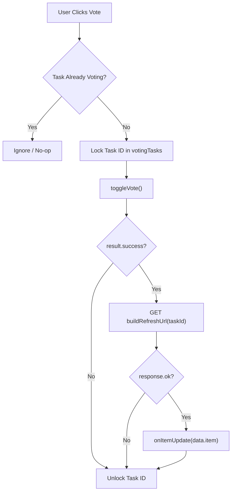

<!-- source-hash: afe909dc035ab417a954948a391b890a -->
Full-page roadmap surface that renders a responsive 2-column grid of `RoadmapCard` components with integrated voting state and live count refresh.

## Key Components

| Export | Type | Description |
|--------|------|-------------|
| `RoadmapGrid` | Component | Main grid component rendering all roadmap items |
| `RoadmapGridProps` | Interface | Component prop contract |
| `DEFAULT_BUILD_REFRESH_URL` | Constant | Default URL builder: `(taskId) => /api/roadmap/${taskId}` |

## Props

| Prop | Type | Default | Description |
|------|------|---------|-------------|
| `items` | `RoadmapItem[]` | — | Roadmap entries to display |
| `onItemUpdate` | `(item: RoadmapItem) => void` | — | Callback fired after a successful vote refresh |
| `showLeftMargin` | `boolean` | `true` | Applies `md:ml-[120px]` for hero alignment; pass `false` for rails |
| `buildRefreshUrl` | `(taskId: string) => string` | `DEFAULT_BUILD_REFRESH_URL` | Path-based URL builder for per-task refresh after vote |
| `votingOptions` | `UseRoadmapVotingOptions` | — | Vote endpoint + storage key forwarded to `useRoadmapVoting` |

## Voting Flow



## Usage Example

```typescript
import { RoadmapGrid } from './roadmap-grid';
import type { RoadmapItem } from '../../chat/types/entities/roadmap-item';

function RoadmapPage({ items }: { items: RoadmapItem[] }) {
  const [roadmapItems, setRoadmapItems] = useState(items);

  const handleItemUpdate = (updated: RoadmapItem) => {
    setRoadmapItems(prev =>
      prev.map(i => (i.id === updated.id ? updated : i))
    );
  };

  return (
    <RoadmapGrid
      items={roadmapItems}
      onItemUpdate={handleItemUpdate}
      showLeftMargin={true}
      buildRefreshUrl={(taskId) => `/api/roadmap/${taskId}`}
      votingOptions={{ endpoint: '/api/votes', storageKey: 'roadmap-votes' }}
    />
  );
}
```

> **Note on `buildRefreshUrl`:** This prop is intentionally a function rather than a string template to safely support embedders whose by-id route shape differs (e.g. `/api/roadmap?id=…`). String concatenation would silently break non-standard routes.