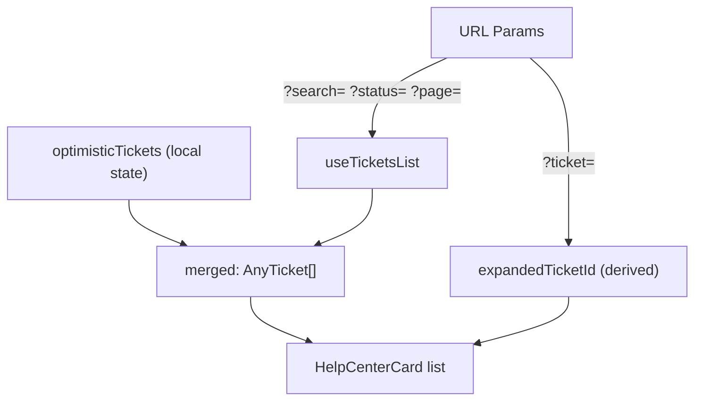

<!-- source-hash: 64a1e228f84c4998c0ec7514f43ae09c -->
Renders the full Help Center surface for the `/tickets` page, managing ticket listing, creation, optimistic updates, and drawer state via URL params.

## Key Components

**`HelpCenterList`** — Public entry point. Handles identity gating: renders a skeleton during auth resolution, an `EmptyState` sign-in prompt for anonymous users, or delegates to the authed sub-component.

**`HelpCenterListAuthed`** — Internal component (not exported) that owns all authenticated state and logic:
- `optimisticTickets` — local placeholder state (intentionally outside TanStack cache)
- `setOpenTicket` — writes/clears `?ticket=<external_id>` URL param to control drawer state
- `removeTicketFromCache` — safely removes a ticket from all `['tickets']` query cache slots via `setQueriesData`
- `toggleRow` — maps internal ticket `id` → `external_id` for URL-driven open/close

**`HelpCenterListProps`** — Single exported interface; accepts an optional `toast` override for testing.

## Usage Example

```typescript
// Mount on the /tickets page (Next.js App Router)
import { HelpCenterList } from '@/components/help-center/help-center-list'

export default function TicketsPage() {
  return <HelpCenterList />
}

// With toast override in tests
import { render } from '@testing-library/react'
import { mockToast } from '../test-utils'

render(<HelpCenterList toast={mockToast} />)
```

## State Model



> URL params are the single source of truth for open drawer, search, status, and pagination. Optimistic placeholders are kept in local state — not the TanStack cache — so filter/page refetches don't evict in-flight placeholders.