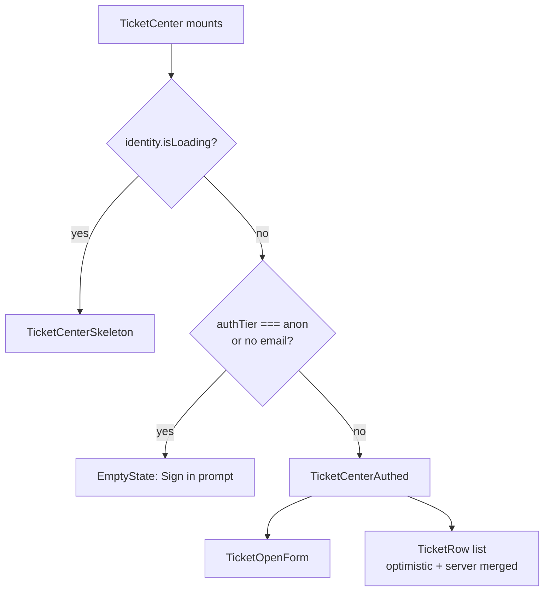

<!-- source-hash: 342918f6f476b195a4bfc05a9be396e0 -->
Customer-facing ticket management surface that renders a full ticket workflow (open, view, reply, close, reopen) for authenticated users, and an identity-gated sign-in prompt for anonymous visitors.

## Key Components

| Export / Symbol | Description |
|---|---|
| `TicketCenter` | Root exported component; handles identity resolution and delegates to `TicketCenterAuthed` or fallback states |
| `TicketCenterAuthed` | Inner authenticated shell; owns optimistic state, query cache mutations, and composes the form + list |
| `TicketCenterSkeleton` | Full-page skeleton shown during the first-mount identity resolution window |
| `TicketListSkeleton` | List-only skeleton shown while ticket data is loading |
| `TicketCenterProps` | Public prop interface — only exposes a `toast` override for testability |

## Usage Example

```typescript
// Minimal embed — relies on a QueryClientProvider + ChatRuntimeContext.Provider
// already mounted at the app root (same pattern as <EmbeddableChat />)
import { TicketCenter } from '@/components/ticket-center/ticket-center'

export function SupportPage() {
  return (
    <main>
      <TicketCenter />
    </main>
  )
}

// Test-friendly override — inject a mock toast to assert notifications
import { TicketCenter } from '@/components/ticket-center/ticket-center'
import { mockToast } from '@/test/helpers'

render(<TicketCenter toast={mockToast} />)
```

## Identity Gate Behavior



## Optimistic Update Strategy

Optimistic tickets are kept in **local state** (not the React Query cache) so a background refetch cannot overwrite pending placeholders mid-flight. The merged view is always `[...optimisticTickets, ...serverTickets]`, placing new pending rows at the top until the server response confirms or rejects them.