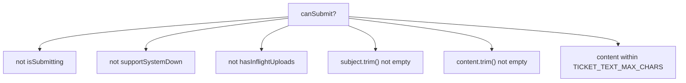

<!-- source-hash: b30cd8d851756508ef3f90328778876a -->
A client-side React form component for creating new support tickets, rendered at the top of the `<TicketCenter />` view. Composes existing OSS-lib primitives for subject input, message textarea, file attachments, and submit action with multi-condition gating.

## Key Components

### `TicketOpenFormProps`
| Prop | Type | Description |
|------|------|-------------|
| `onSubmit` | `(input) => Promise<boolean>` | Wired to `useTicketActions().submitTicket`; returns `true` on success to trigger form reset |
| `isSubmitting` | `boolean` | Parent-owned single-flight submission flag |
| `supportSystemDown` | `boolean` | Disables all inputs and submit when the support system is offline |

### Submit Gating (`canSubmit`)
The submit button is enabled only when **all** conditions pass:



### Internal State
- `subject` / `content` — controlled inputs, cleared on successful submit
- `attachments` — managed via `useChatAttachments()`, sharing the same upload pipeline as the chat composer

## Usage Example

```typescript
import { TicketOpenForm } from './ticket-open-form'
import { useTicketActions } from './hooks/use-ticket-actions'

function TicketCenter() {
  const { submitTicket, isSubmitting } = useTicketActions()
  const supportSystemDown = false

  return (
    <TicketOpenForm
      onSubmit={submitTicket}
      isSubmitting={isSubmitting}
      supportSystemDown={supportSystemDown}
    />
  )
}
```

> A character counter appears once content reaches 80% of `TICKET_TEXT_MAX_CHARS` and turns red if the limit is exceeded, blocking submission.