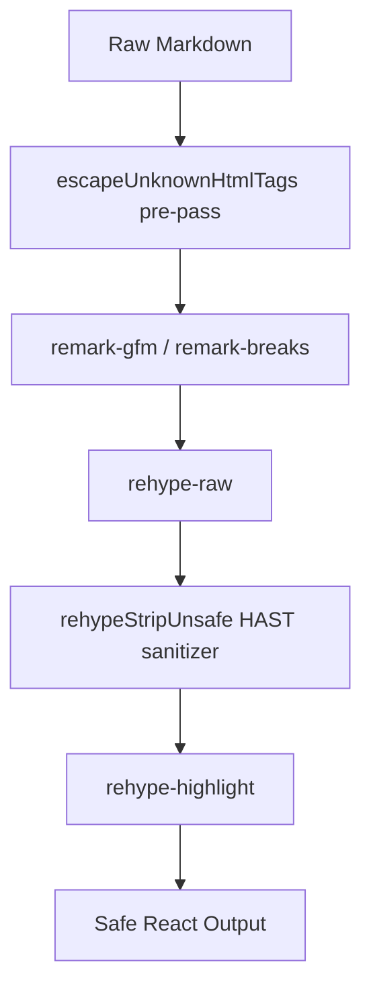

<!-- source-hash: 9a47236bd9fd4f90eece958d3708b946 -->
A client-side React component that renders Markdown content with GFM support, syntax highlighting, raw HTML passthrough, and a layered XSS sanitization pipeline designed for safe rendering of LLM-generated output.

## Key Components

### Rehype Plugins

- **`rehypeStripUnsafe()`** — Custom HAST sanitizer that runs after `rehype-raw`. Strips dangerous elements (`<script>`, `<style>`, `<object>`, etc.), removes `on*` event handler attributes, and blocks `javascript:` / `data:` URI schemes on all URL-bearing attributes including multi-candidate `srcset`.

- **`srcsetHasUnsafeCandidate(srcset)`** — Helper that splits `srcset` attribute values by comma and validates each URL candidate individually to prevent injection via secondary candidates.

- **`escapeUnknownHtmlT...` (truncated)** — Pre-pass that escapes unrecognized HTML-like tags in raw markdown text before `rehype-raw` processes them, preventing React warnings/errors from LLM-emitted pseudo-XML tags like `<ticket>` or `<their>`.

### URL Transform

- **`cardAwareUrlTransform(url, key)`** — Extends `react-markdown`'s default URL sanitizer to allow `card://` and `mention://` internal schemes on `href` attributes only (used by `remarkCardLinks` and `remarkMentionChips` plugins), while keeping all other dangerous schemes blocked.

### Constants

- **`SAFE_HTML_TAGS`** — Allowlist of permitted HTML tag names forwarded to React. Explicitly excludes `<video>` (handled by a separate pipeline component).
- **`TAG_LIKE_REGEX`** — ReDoS-safe regex (CodeQL-hardened, bounded quantifiers) for matching HTML-like tags in markdown source.

## Usage Example

```typescript
import { SimpleMarkdownRenderer } from './simple-markdown-renderer';

// Basic rendering with safe LLM output
<SimpleMarkdownRenderer content="## Hello\n\nThis is **markdown** with `code`." />

// With authenticated image sources and link resolution
<SimpleMarkdownRenderer
  content={llmMarkdownOutput}
  resolveLink={(href) => ({ url: href, label: href })}
/>
```

## Security Model

The sanitization runs in two layers:



> **Source:** [`simple-markdown-renderer.tsx`](https://github.com/flamingo-stack/openframe-oss-lib/blob/main/simple-markdown-renderer.tsx)