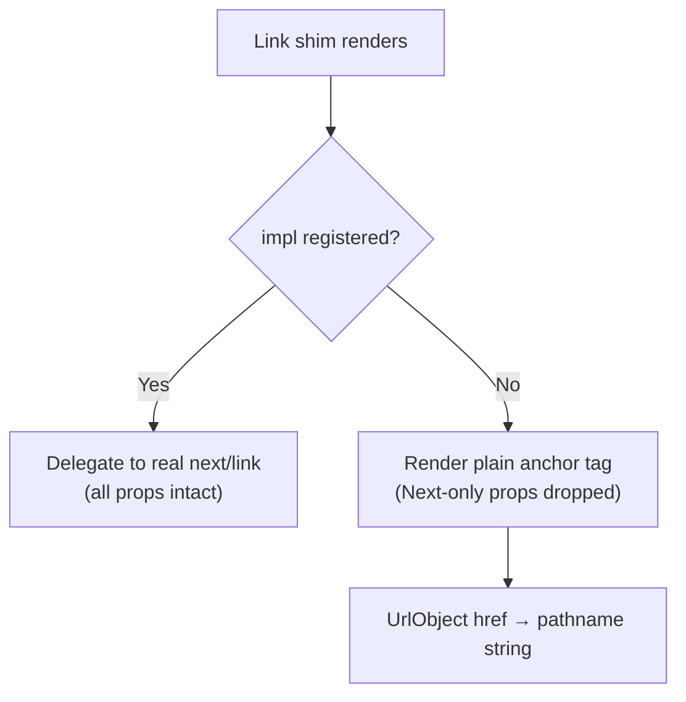

<!-- source-hash: 0eb3ce12c588e5ff9c30c2f3550ce64f -->
Environment-aware `next/link` shim that renders a plain `<a>` tag by default, enabling use in non-Next.js hosts (Vite, CRA, esbuild), while allowing full `next/link` functionality via opt-in registration.

## Key Components

| Export | Type | Description |
|--------|------|-------------|
| `Link` | `ForwardRefExoticComponent` | Default export — the shim component itself |
| `registerLink` | `(component: ComponentType) => void` | Registers the real `next/link` at app init |
| `LinkProps` | `type` | Extended anchor props including Next.js-specific options (`prefetch`, `replace`, `scroll`, `locale`, etc.) |

## Behavior



## Usage Example

**Non-Next.js host (default fallback — no setup needed):**

```typescript
import Link from './next-link'

// Renders a plain <a href="/about">
<Link href="/about">About</Link>
```

**Next.js host — register once at app init:**

```typescript
// lib/embed-shim-registration.ts
import NextLink from 'next/link'
import { registerLink } from '@flamingo-stack/openframe-frontend-core/embed-shims'

registerLink(NextLink)
```

**After registration — full Next.js routing features work:**

```typescript
import Link from './next-link'

// Delegates to real next/link with prefetch, replace, scroll, locale
<Link href="/dashboard" prefetch replace scroll={false} locale="en">
  Dashboard
</Link>

// UrlObject href also supported
<Link href={{ pathname: '/user', query: { id: '42' } }}>
  Profile
</Link>
```

> **Note:** `registerLink` must be called exactly once before any shim renders. In the fallback path, Next.js-specific props (`prefetch`, `replace`, `scroll`, `shallow`, `locale`, etc.) are silently dropped to keep the plain `<a>` clean.