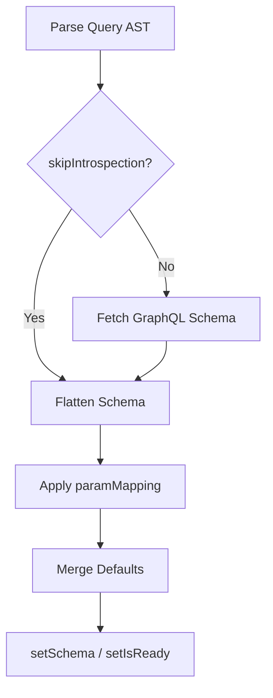

<!-- source-hash: 3c17907a5e162575a9da5189c583b2d4 -->
Bidirectional URL state management hook that automatically generates GraphQL-compatible variables from URL search parameters by parsing a GraphQL `DocumentNode` AST, optionally enriching it via schema introspection, and flattening nested input types into flat URL params.

## Key Components

| Export | Type | Description |
|--------|------|-------------|
| `useQueryParams` | Hook | Core hook — parses query AST, fetches schema, syncs URL ↔ GraphQL variables |
| `UseQueryParamsOptions` | Interface | Configuration: defaults, introspection endpoint/headers, param mapping, debug |
| `UseQueryParamsReturn` | Interface | Hook return shape: `variables`, `params`, `schema`, setters, state flags |
| `applyParamMapping` | Function (internal) | Remaps flattened schema keys using a custom `paramMapping` record |

### Initialization Flow



## Usage Example

```typescript
import { gql, useQuery } from '@apollo/client'
import { useQueryParams } from './use-query-params'

const LOGS_QUERY = gql`
  query GetLogs($search: String, $filter: LogFilterInput) {
    logs(search: $search, filter: $filter) {
      id
      message
      severity
    }
  }
`

function LogsPage() {
  const { variables, setParam, setParams, clearParams, resetParams, isReady } =
    useQueryParams(LOGS_QUERY, {
      defaultValues: { filter: { severity: ['info'] } },
      introspectionEndpoint: 'https://api.example.com/graphql',
      introspectionHeaders: { Authorization: 'Bearer token' },
      debug: true,
    })

  const { data } = useQuery(LOGS_QUERY, { variables, skip: !isReady })

  return (
    <>
      {/* URL: /logs?search=error&severity=critical */}
      {/* variables: { search: 'error', filter: { severity: ['critical'] } } */}
      <input onChange={e => setParam('search', e.target.value)} />
      <button onClick={() => clearParams(['search'])}>Clear</button>
      <button onClick={resetParams}>Reset All</button>
    </>
  )
}
```

> **Note:** Schema introspection results are cached via `introspector` — subsequent calls with the same endpoint skip the network fetch. Set `skipIntrospection: true` if your input types are shallow (no nested objects) to avoid the extra request.