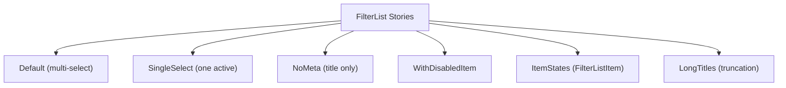

<!-- source-hash: 488942b1b8a347ad8c23f81bddec013a -->
Storybook stories for the `FilterList` UI component, covering multi-select, single-select, disabled items, item states, and long title truncation behaviors.

## Key Components

| Export | Type | Description |
|--------|------|-------------|
| `Default` | `Story` | Multi-select list with pre-selected item |
| `SingleSelect` | `Story` | Single-selection mode (`multiple: false`) |
| `NoMeta` | `Story` | Items rendered with title only, no meta values |
| `WithDisabledItem` | `Story` | List with one individually disabled row |
| `ItemStates` | `StoryObj` | Side-by-side `FilterListItem` in default and selected states |
| `LongTitles` | `Story` | Validates ellipsis truncation on long titles |

## Usage Example

```typescript
import { FilterList } from '../components/ui/filter-list';
import { useState } from 'react';

const items = [
  { id: '1', title: 'Acme Corporation', meta: ['Technology', '100 devices'] },
  { id: '2', title: 'Globex Inc.', meta: ['Finance', '245 devices'] },
  { id: '3', title: 'Initech', meta: ['Consulting', '58 devices'], disabled: true },
];

export function OrgFilter() {
  const [selected, setSelected] = useState<string[]>(['1']);

  return (
    <FilterList
      items={items}
      selectedIds={selected}
      onChange={setSelected}
      multiple={false} // omit for multi-select (default)
    />
  );
}
```

## Story Variants



Selected rows render with a yellow-secondary background and accent-colored meta text. Each story wraps `useState` internally so selection state is interactive inside Storybook.