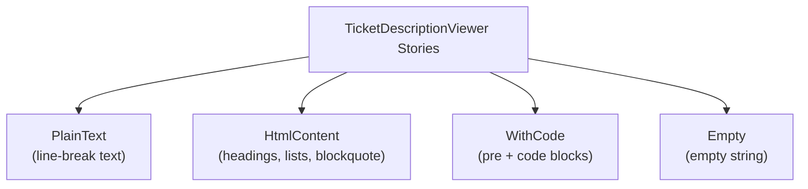

<!-- source-hash: 70e0ec1bd6faabbc539fcfb3af28cb70 -->
Storybook stories for the `TicketDescriptionViewer` component, providing visual test cases for rendering ticket description content in various formats (plain text, HTML, code, and empty states).

## Key Components

| Export | Type | Description |
|--------|------|-------------|
| `meta` | `Meta` | Storybook metadata — mounts component at `Tickets/TicketDescriptionViewer` with a 600px wrapper |
| `PlainText` | `Story` | Plain text with line breaks |
| `HtmlContent` | `Story` | Rich HTML with headings, lists, blockquotes |
| `WithCode` | `Story` | Inline and block `<code>` / `<pre>` elements |
| `Empty` | `Story` | Empty string fallback rendering |

## Usage Example

```typescript
import { TicketDescriptionViewer } from '../components/ui/ticket-description-viewer';

// Plain text
<TicketDescriptionViewer content="Reduce onboarding from 4 weeks to 10 days." />

// HTML from RichTextEditor output
<TicketDescriptionViewer content="<h2>Steps</h2><ul><li>Setup</li></ul>" />

// Empty state
<TicketDescriptionViewer content="" />
```

## Story Overview



> All stories render inside a 600px-wide decorator div to simulate a realistic ticket detail panel width, matching the expected `RichTextEditor` output environment.