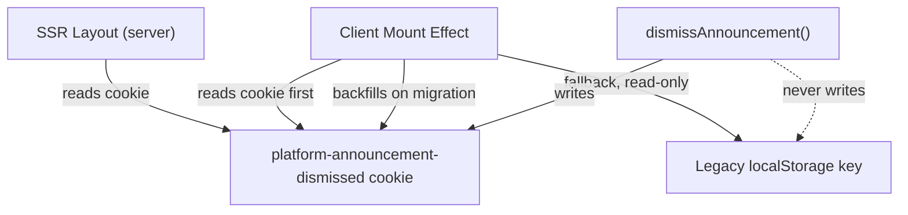

<!-- source-hash: eaaab09af79a45c05efef4de2c5f0db6 -->
Manages announcement dismissal state using a cookie-first strategy, enabling SSR-safe dismissal detection and seamless migration from a legacy localStorage approach.

## Key Components

| Export | Type | Description |
|--------|------|-------------|
| `announcementDismissCookieName` | `function` | Returns the canonical cookie name for a platform's dismissed announcement ID |
| `isDismissedCookieValue` | `function` | Pure/isomorphic ID-match check shared across server and client boundaries |
| `dismissAnnouncement` | `function` | Persists a dismissal to cookie only (1-year `max-age`); intentionally skips localStorage |
| `isAnnouncementDismissed` | `function` | Cookie-first client-side check, with legacy localStorage fallback when no cookie exists |
| `clearAnnouncementDismissals` | `function` | Removes all dismissal state (cookie + legacy localStorage keys) — for tests/stories |
| `clearLegacyAnnouncementCache` | `function` | One-time cleanup of the pre-refactor announcement cache blob from localStorage |

## Storage Architecture



## Usage Example

```typescript
import {
  announcementDismissCookieName,
  isDismissedCookieValue,
  dismissAnnouncement,
  isAnnouncementDismissed,
  clearAnnouncementDismissals,
} from './announcement-storage'

// Server-side (Next.js layout): check if already dismissed via cookie
const cookieValue = cookies().get(announcementDismissCookieName('hub'))?.value
const shouldSeedBar = !isDismissedCookieValue(cookieValue, activeAnnouncement.id)

// Client-side: check dismissal from an effect (never during render)
useEffect(() => {
  if (isAnnouncementDismissed('hub', announcement.id)) {
    setVisible(false)
  }
}, [announcement.id])

// On user dismiss
function handleDismiss() {
  dismissAnnouncement('hub', announcement.id)
  setVisible(false)
}

// In tests/Storybook: reset state between stories
afterEach(() => clearAnnouncementDismissals('hub'))
```

> **Note:** `isAnnouncementDismissed` reads browser storage and must only be called from effects — never during render — to avoid SSR/hydration mismatches.

## Source

[`announcement-storage.ts`](https://github.com/flamingo-stack/openframe-oss-lib/blob/main/announcement-storage.ts)