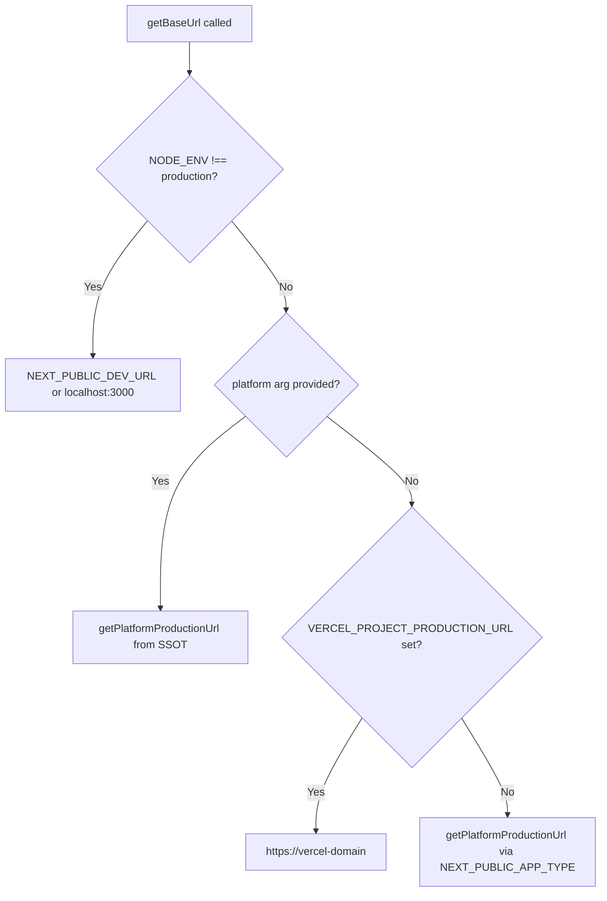

<!-- source-hash: 700d6c65ebfb65630e665b437acf4e83 -->
Utility module providing two core helpers: a Tailwind-aware class name merger (`cn`) that correctly handles custom ODS typography utilities, and an environment-aware base URL resolver (`getBaseUrl`) that delegates platform canonical URLs to the SSOT in `platform-domains.ts`.

## Key Components

| Export | Type | Description |
|--------|------|-------------|
| `cn` | `function` | Combines class names using `clsx` + a custom `tailwind-merge` instance |
| `getBaseUrl` | `function` | Returns the application base URL for the current environment |
| `twMerge` | internal | Extended `tailwind-merge` instance with the `ods-typography` class group |

### `ods-typography` Class Group

Custom Tailwind text-size utilities registered to prevent silent conflicts with `text-color` utilities:

```text
text-h1 · text-h2 · text-h3 · text-h4 · text-h5 · text-h6 · text-code · text-badge
```

Without this registration, `cn('text-badge', 'text-ods-text-on-accent')` would drop `text-badge` — only the colour survives.

## Usage Example

```typescript
import { cn, getBaseUrl } from '@/lib/cn'

// Merge conditional classes safely — typography and colour both survive
const className = cn(
  'text-badge',
  'text-ods-text-on-accent',
  isActive && 'bg-accent',
)

// Current deployment URL (dev → localhost, prod → Vercel/canonical domain)
const currentUrl = getBaseUrl()

// Specific platform URL (respects env override, falls back to canonical)
const flamingoUrl = getBaseUrl('flamingo')  // https://www.flamingo.run
const openMspUrl  = getBaseUrl('openmsp')   // https://www.openmsp.ai
```

## `getBaseUrl` Resolution Order



> Platform canonical URLs and their `NEXT_PUBLIC_*_URL` environment overrides are defined exclusively in [`src/platform-domains.ts`](https://github.com/flamingo-stack/openframe-oss-lib/blob/main/src/platform-domains.ts).