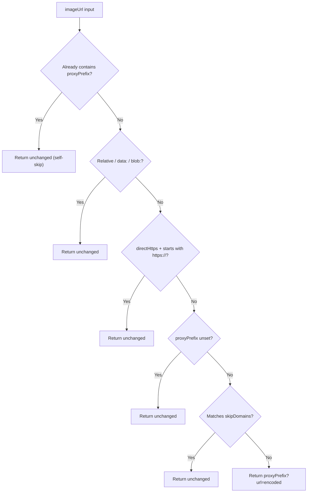

<!-- source-hash: 96c8aeb6b887afbf8566d95db7ee4847 -->
Pure utility module for building image proxy URLs and related image-loading helpers, with no side effects or environment dependencies.

## Key Components

| Export | Type | Description |
|--------|------|-------------|
| `GetProxiedImageUrlOptions` | Type | Configuration shape for proxy prefix, skip domains, and direct-HTTPS bypass |
| `getProxiedImageUrl` | Function | Core URL resolver — routes an image URL through the proxy or returns it unchanged based on resolution rules |
| `urlPathLooksLikeSvg` | Function | Heuristic check for `.svg` file extension in a URL path |
| `shouldProxyImage` | Function | Boolean guard indicating whether a URL requires proxying |
| `generateImageSizes` | Function | Returns a standard responsive `sizes` attribute string for `` tags |

## Resolution Order (`getProxiedImageUrl`)



## Usage Example

```typescript
import {
  getProxiedImageUrl,
  urlPathLooksLikeSvg,
  shouldProxyImage,
} from './image-proxy';

const proxyPrefix = '/api/image-proxy';
const skipDomains = ['cdn.mycompany.com'];

// Standard proxy wrap
getProxiedImageUrl('https://external.com/photo.jpg', { proxyPrefix, skipDomains });
// → '/api/image-proxy?url=https%3A%2F%2Fexternal.com%2Fphoto.jpg'

// Skip proxy for own CDN
getProxiedImageUrl('https://cdn.mycompany.com/logo.png', { proxyPrefix, skipDomains });
// → 'https://cdn.mycompany.com/logo.png'

// Bypass proxy for SVGs only
const url = 'https://external.com/icon.svg';
getProxiedImageUrl(url, {
  proxyPrefix,
  directHttps: urlPathLooksLikeSvg(url), // true → bypass
});
// → 'https://external.com/icon.svg'

// Guard before proxying
shouldProxyImage('https://external.com/img.png', proxyPrefix); // → true
shouldProxyImage('/relative/path.png', proxyPrefix);            // → false
```

## Notes

- **Caller-owned config** — no env reads; proxy prefix and skip list are passed in at the call site, typically from `ChatRuntime.endpoints.imageProxyUrlPrefix`.
- **HTTP stays proxied** even when `directHttps: true` to avoid mixed-content issues.
- Relative URLs, `data:`, and `blob:` URIs always pass through unchanged.