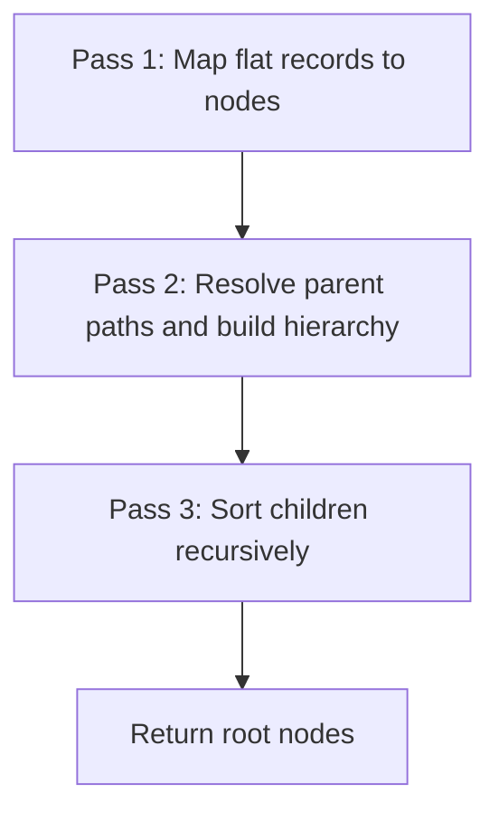

<!-- source-hash: e02e3bf5bd0b2062565eb3542938d795 -->
Builds hierarchical document trees from flat record lists using a generic 3-pass algorithm, shared across all doc-source DALs in the OpenFrame platform.

## Key Components

| Export | Type | Description |
|---|---|---|
| `TreeNodeBase` | Interface | Base shape for tree nodes — extend with domain-specific fields |
| `formatDocName` | Function | Strips `.md` extension, handles `README` casing, and humanizes hyphenated names |
| `sortTreeChildren` | Function | Recursively sorts nodes: README first → folders → files, each sub-group ordered by `sortOrder` then alphabetically |
| `buildDocumentTree` | Function | Generic 3-pass tree builder accepting mapper and path resolver callbacks |

## 3-Pass Algorithm



## Usage Example

```typescript
import { buildDocumentTree, formatDocName, TreeNodeBase } from './tree-builder'

interface DocNode extends TreeNodeBase {
  slug: string
}

interface DbDoc {
  path: string
  parent_path: string | null
  name: string
  type: 'file' | 'folder'
}

const docs: DbDoc[] = fetchDocsFromDb()

const tree = buildDocumentTree<DocNode, DbDoc>(
  docs,
  (doc) => ({
    id: doc.path,
    name: formatDocName(doc.name),
    path: doc.path,
    type: doc.type,
    slug: doc.path.split('/').pop() ?? '',
    children: [],
  }),
  (doc) => doc.parent_path,  // Pass 2: explicit parent path
  (doc) => doc.path          // Pass 2: node's own path key
)
```

## Sort Order

| Priority | Rule |
|---|---|
| 1 | `README` / `readme.md` always first |
| 2 | Folders before files |
| 3 | Ascending `sortOrder` (nodes without it sort last) |
| 4 | Alphabetical (locale-insensitive) |

**Source:** [`lib/tree-builder.ts`](https://github.com/flamingo-stack/openframe-oss-lib/blob/main/lib/tree-builder.ts)