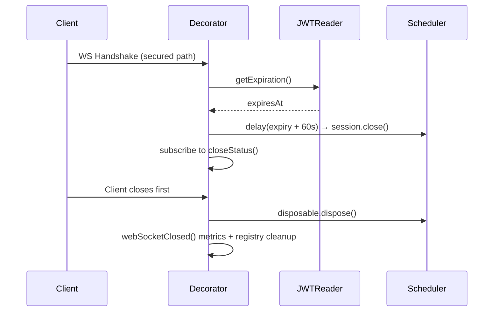

<!-- source-hash: fef90abf3194352d4d9d049e01051e92 -->
A decorator for Spring's `WebSocketService` that enforces JWT-based session lifecycle management on secured WebSocket endpoints in the OpenFrame API gateway.

## Key Components

| Component | Description |
|-----------|-------------|
| `WebSocketServiceSecurityDecorator` | Core decorator implementing `WebSocketService`; intercepts WebSocket handshakes on secured paths |
| `sessionRegistry` | `ConcurrentHashMap` tracking active sessions with creation time, path, and subject (`sub`) |
| `SessionInfo` | Record holding session metadata: `createdAt`, `path`, `sub` |
| `CLOCK_SKEW_SECONDS` | 60-second buffer added to JWT expiry to align with Spring Security's default clock skew |
| `isSecuredEndpoint()` | Checks if the request path matches known secured WS prefixes (tools API/agent, NATS) |
| `scheduleSessionRemoveJob()` | Schedules a reactive delayed close when the JWT expires (expiry + skew seconds) |
| `processSessionClosedEvent()` | Subscribes to the session's close status to clean up registry, cancel the scheduled job, and emit metrics |

## Usage Example

```java
// Registered as a Spring Bean — typically in WebSocketGatewayConfig
@Bean
public WebSocketService webSocketService(
        WebSocketService defaultWebSocketService,
        RequestJwtClaimsReader jwtClaimsReader,
        GatewayTrafficMetrics metrics,
        WebSocketLoggingProperties loggingProps) {

    return new WebSocketServiceSecurityDecorator(
            defaultWebSocketService,
            jwtClaimsReader,
            metrics,
            loggingProps
    );
}
```

**Session lifecycle flow:**



> **Note:** Hardcoded secured path matching is a known limitation — a TODO exists to delegate authorization to Spring Security instead of matching prefixes manually.