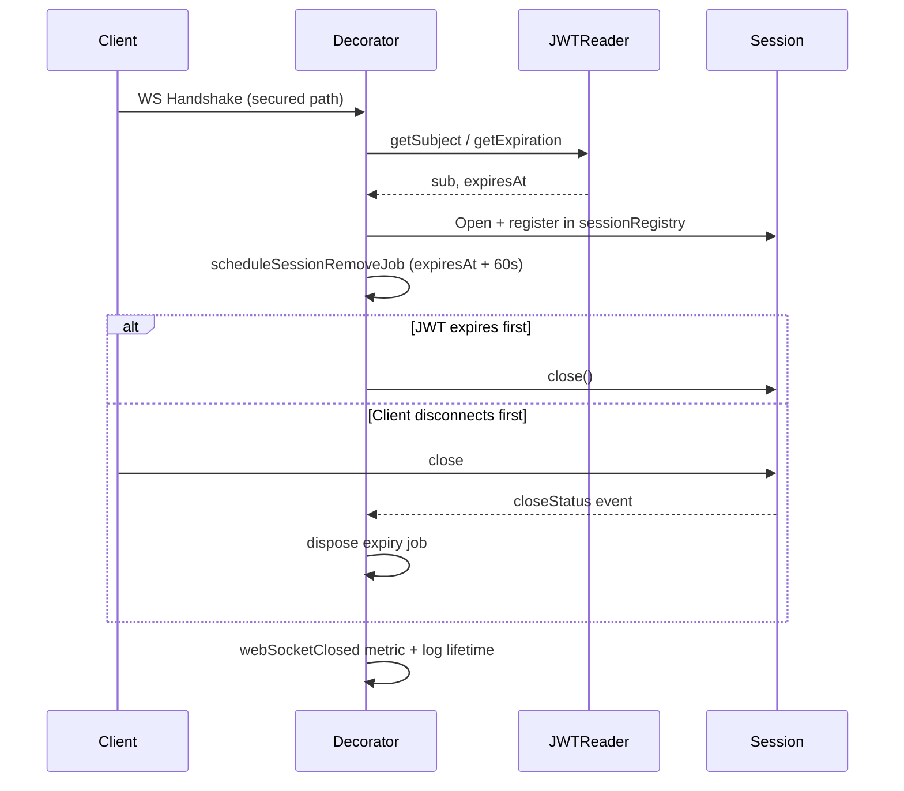

<!-- source-hash: fef90abf3194352d4d9d049e01051e92 -->
A reactive WebSocket security decorator that enforces JWT-based session lifecycle management for secured WebSocket endpoints in the OpenFrame API gateway.

## Key Components

| Component | Description |
|-----------|-------------|
| `WebSocketServiceSecurityDecorator` | Implements `WebSocketService` to wrap the default handler with JWT expiry enforcement |
| `sessionRegistry` | `ConcurrentHashMap` tracking active sessions with creation time, path, and subject |
| `SessionInfo` | Record holding session metadata (`createdAt`, `path`, `sub`) |
| `CLOCK_SKEW_SECONDS` | 60-second buffer added to JWT expiration to align with Spring Security's default skew |
| `isSecuredEndpoint()` | Checks if the request path matches known secured WS endpoint prefixes |
| `scheduleSessionRemoveJob()` | Schedules a delayed `Mono` to forcibly close the session when the JWT expires |
| `processSessionClosedEvent()` | Subscribes to session close status, records metrics, disposes the expiry job, and logs lifetime |

## Usage Example

```java
@Bean
public WebSocketServiceSecurityDecorator webSocketServiceSecurityDecorator(
        WebSocketService defaultWebSocketService,
        RequestJwtClaimsReader requestJwtReader,
        GatewayTrafficMetrics gatewayTrafficMetrics,
        WebSocketLoggingProperties loggingProperties) {

    return new WebSocketServiceSecurityDecorator(
            defaultWebSocketService,
            requestJwtReader,
            gatewayTrafficMetrics,
            loggingProperties
    );
}
```

## Session Lifecycle



> **Note:** Hardcoded secured path detection (`TOOLS_API_WS_ENDPOINT_PREFIX`, `NATS_WS_ENDPOINT_PATH`, etc.) is a known TODO — future versions will delegate endpoint security resolution to Spring Security.