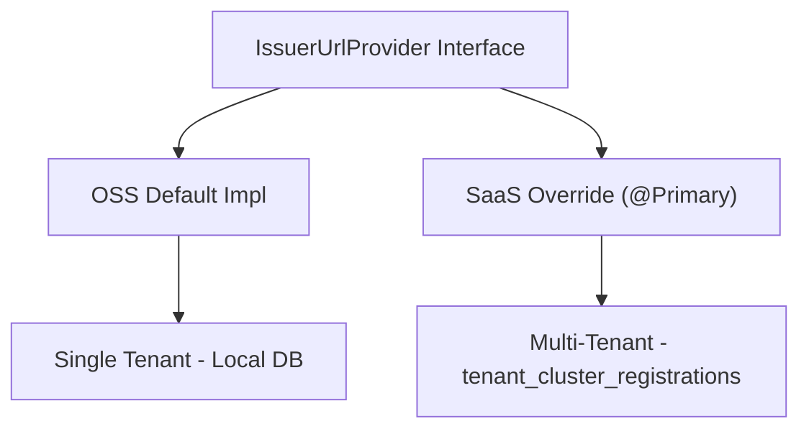

<!-- source-hash: 4f85a3190b768380f7e64d14c662a546 -->
Defines the contract for resolving JWT issuer URLs accepted by the gateway, supporting both single-tenant (OSS) and multi-tenant (SaaS) deployments.

## Key Components

| Member | Type | Description |
|--------|------|-------------|
| `resolveIssuerUrls()` | `Mono<List<String>>` | Reactively fetches the current list of accepted JWT issuer URLs |
| `getCachedIssuerUrl()` | `List<String>` | Returns the last cached issuer URLs synchronously, avoiding a blocking call on the hot path |

## Implementation Strategy



- **OSS default** — reads a single `Tenant` record from the local database
- **SaaS override** — annotated `@Primary`, reads from `tenant_cluster_registrations` to support multiple tenants per pod

## Usage Example

```java
@Component
public class JwtSecurityConfig {

    private final IssuerUrlProvider issuerUrlProvider;

    public JwtSecurityConfig(IssuerUrlProvider issuerUrlProvider) {
        this.issuerUrlProvider = issuerUrlProvider;
    }

    public Mono<List<String>> getAcceptedIssuers() {
        // Reactive fetch - use on startup or cache refresh
        return issuerUrlProvider.resolveIssuerUrls();
    }

    public List<String> getAcceptedIssuersCached() {
        // Synchronous cache read - use on hot path (e.g., per-request JWT validation)
        return issuerUrlProvider.getCachedIssuerUrl();
    }
}
```

> Implementations should populate the cache on startup and refresh it periodically so `getCachedIssuerUrl()` is always non-blocking and up to date.