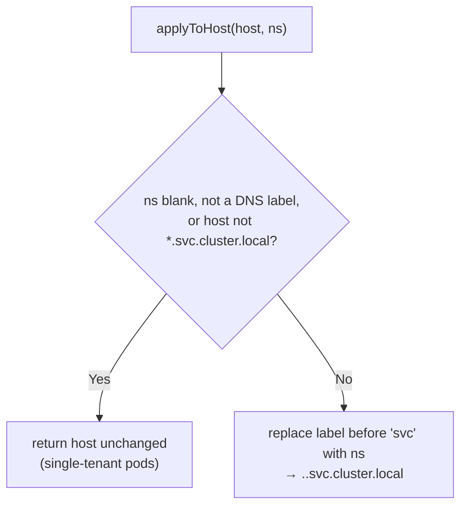

<!-- source-hash: df78b4f35567d29723f40559ec50e76b -->
Per-request tenant-namespace rewriting for a shared multi-tenant gateway pod. Substitutes the calling tenant's Kubernetes namespace (and tenant id) into upstream cluster-local hosts, resolved from the trusted `X-Tenant-Ns` / `X-Tenant-Id` headers instead of a pod-wide property.

## Key Components

| Member | Type | Description |
|--------|------|-------------|
| `TENANT_ID_HEADER` | `String` constant | `X-Tenant-Id` — trusted per-request tenant id injected by the shared gateway |
| `TENANT_NS_HEADER` | `String` constant | `X-Tenant-Ns` — trusted per-request tenant Kubernetes namespace |
| `TENANT_UUID_PLACEHOLDER` | `String` constant | `tenant-uuid` — literal token in shared-pod config replaced by the per-request tenant id in a path |
| `DNS_LABEL` | `Pattern` | DNS-1123 label guard; a namespace that fails it is never spliced into a host |
| `tenantNamespace(request)` | Method | Reads `X-Tenant-Ns`, or `null` when absent |
| `tenantId(request)` | Method | Reads `X-Tenant-Id`, or `null` when absent |
| `applyToHost(host, ns)` | Method | Replaces the namespace label (immediately before `svc`) of a `*.svc.cluster.local` host; no-op otherwise |
| `applyToUri(uri, ns)` | Method | Rewrites a URI's host namespace, preserving scheme/userinfo/port/raw-path/raw-query/fragment verbatim |

## Behavior



## Usage Example

```java
// In an upstream resolver holding the per-request ServerHttpRequest:
URI resolved = proxyUrlResolver.resolve(TOOL_ID, url, port, request.getURI(), stripPrefix);
URI tenantScoped = GatewayTenantNamespace.applyToUri(
        resolved, GatewayTenantNamespace.tenantNamespace(request));
// http://meshcentral.tenant-ns.svc.cluster.local:8383/x  →  http://meshcentral.acme.svc.cluster.local:8383/x
```

## Notes

- **Additive by design.** Without an `X-Tenant-Ns` header (single-tenant / OSS pods, and not-yet-migrated stage/prod) every method returns its input unchanged, so those deployments keep their configured namespaces.
- **Raw components preserved.** `applyToUri` rebuilds from raw parts so base64 `=` padding in tool auth cookies (carried in the query) is not rejected by strict URI builders.
- **Defensive validation.** The DNS-1123 guard means a forged header cannot inject arbitrary host content even in a context that did not validate the header upstream.
- Header names are kept in sync by convention with the SaaS tenant gateway's `GatewayTenantContext` rather than shared through a type, mirroring that repository's deliberate choice.
