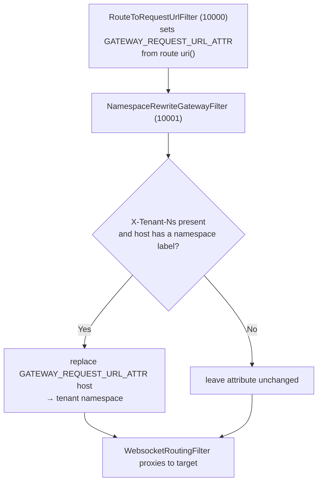

<!-- source-hash: b1fa393cb06694504ac18f54fa335202 -->
Route-scoped Spring Cloud Gateway filter that rewrites a route's resolved target host to the calling tenant's Kubernetes namespace, for routes whose `uri(...)` is a static cluster-local address carrying a namespace placeholder (e.g. the NATS WebSocket routes).

## Key Components

| Member | Type | Description |
|--------|------|-------------|
| `filter()` | Method | Reads `X-Tenant-Ns`, rewrites the host of `GATEWAY_REQUEST_URL_ATTR` via `TenantRoutingHeaders.applyToUri`, and stores it back; no-op when the header is absent or the host has no namespace label |
| `getOrder()` | Method | `ROUTE_TO_URL_FILTER_ORDER + 1` — runs right after `RouteToRequestUrlFilter`, which populates the request-URL attribute |

## Routing Logic



## Usage Example

```java
// Attach to a route whose static uri carries a namespace placeholder:
.route("nats_websocket_route", r -> r
        .path("/ws/nats")
        .filters(f -> f.filter(namespaceRewriteFilter))
        .uri("ws://nats.tenant-ns.svc.cluster.local:8080"))
// ws://nats.tenant-ns.svc.cluster.local:8080  →  ws://nats.<tenantNs>.svc.cluster.local:8080
```

## Notes

- It is a `GatewayFilter`, **not** a `GlobalFilter`, so it only runs on routes it is explicitly attached to. Shared-infra routes in fixed namespaces must not carry it.
- Tool-proxy routes do not need it — their `ToolUpstreamResolver` implementations already namespace per request.
- No-op on single-tenant pods (no `X-Tenant-Ns` header), keeping the static-URI routes working unchanged.
