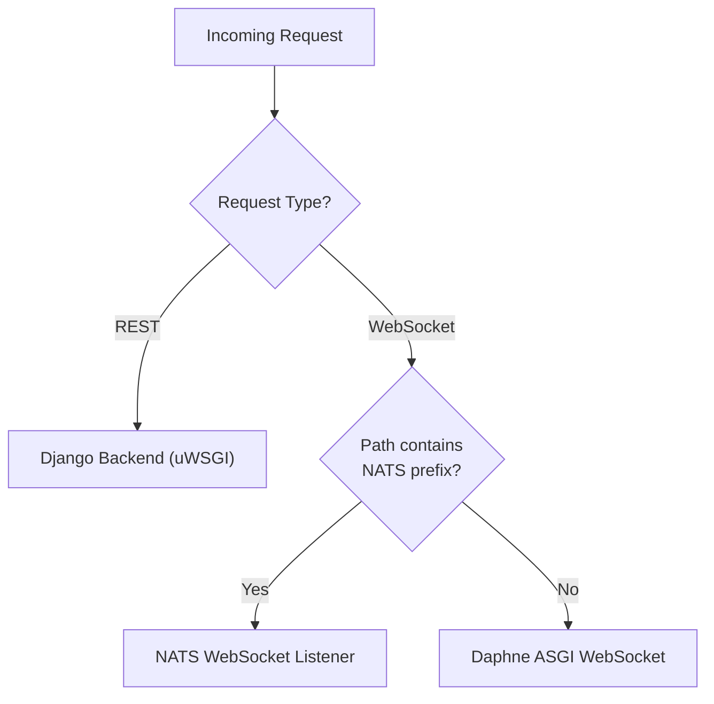

<!-- source-hash: 2b7ae2070647648eb3c63b6808cbebf2 -->
Resolves upstream target URIs for Tactical-RMM tool requests within the OpenFrame gateway, routing traffic to one of three independent backends (REST/Django, NATS WebSocket, or Daphne ASGI) based on request type and path.

## Key Components

| Member | Type | Description |
|--------|------|-------------|
| `TOOL_ID` | `String` constant | Identifies this resolver as handling `"tactical-rmm"` |
| `supportsToolId()` | Method | Returns `"tactical-rmm"` to register this resolver with the upstream routing system |
| `resolveRest()` | Method | Routes all REST requests to the Django/uWSGI backend |
| `resolveWs()` | Method | Routes WebSocket requests to either the NATS listener or Daphne ASGI based on path inspection |
| `isNatsPath()` | Method | Checks if the request path contains the configured NATS path prefix |
| `TacticalRmmRoutingProperties` | Dependency | Supplies upstream URLs, ports, and path prefixes from `openframe.tools.tactical-rmm.*` in `application.yml` |
| `ProxyUrlResolver` | Dependency | Constructs the final proxy `URI` from upstream config and incoming request |

## Routing Logic



## Usage Example

```java
// Registered automatically via @Component; consumed by the gateway routing layer.
// Configuration in application.yml:
//
// openframe:
//   tools:
//     tactical-rmm:
//       backend:
//         url: http://tactical-backend
//         port: 8080
//       nats:
//         url: http://tactical-nats
//         port: 4222
//         path-prefix: /natsws
//       websocket:
//         url: http://tactical-daphne
//         port: 8001

@Autowired
TacticalRmmUpstreamResolver resolver;

// REST request → routes to Django backend
URI restTarget = resolver.resolveRest(tool, httpRequest, "/tactical-rmm");

// WebSocket request with /natsws path → routes to NATS
URI wsNatsTarget = resolver.resolveWs(tool, natsWsRequest, "/tactical-rmm");

// WebSocket request with other path → routes to Daphne
URI wsDaphneTarget = resolver.resolveWs(tool, daphneWsRequest, "/tactical-rmm");
```