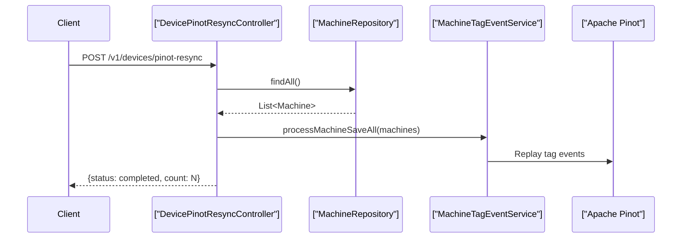

<!-- source-hash: c25f0adff00244ca88f8220ffa2739bd -->
Exposes a REST endpoint to trigger a full resync of all device (machine) records into Apache Pinot by replaying machine tag events.

## Key Components

| Component | Description |
|-----------|-------------|
| `DevicePinotResyncController` | Spring `@RestController` handling device resync operations |
| `POST /v1/devices/pinot-resync` | Endpoint that fetches all machines and replays save events to Pinot |
| `MachineRepository` | JPA/MongoDB repository used to retrieve all machine records |
| `MachineTagEventService` | Service responsible for publishing machine save events downstream to Pinot |

## Usage Example

```bash
# Trigger a full device resync to Apache Pinot
curl -X POST https://<host>/v1/devices/pinot-resync
```

**Expected response:**

```json
{
  "status": "completed",
  "count": 142
}
```

## Behavior



> **Note:** This endpoint performs a bulk operation — all machines in the repository are fetched and re-published synchronously. Use with caution in large environments, as execution time scales with the total number of managed devices.