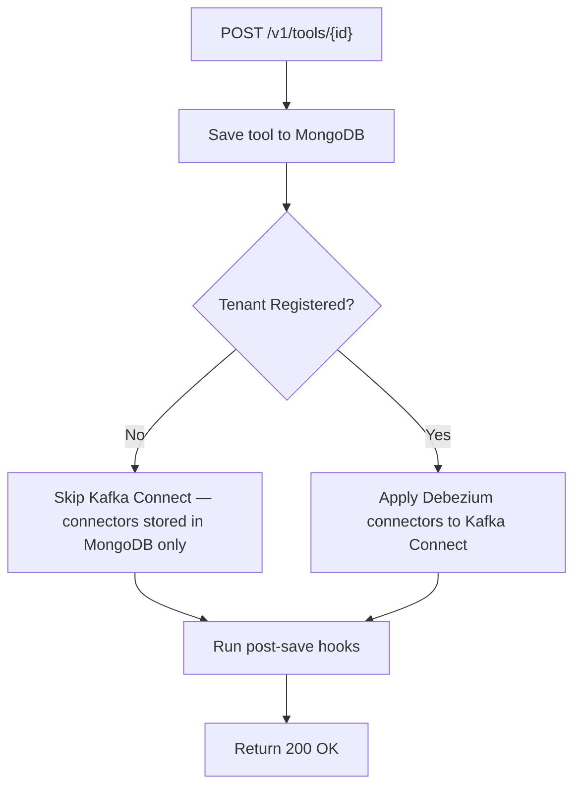

<!-- source-hash: 1fbd206995c35cc266ce92120466da8f -->
REST controller managing CRUD operations for integrated tools in the OpenFrame platform, exposing endpoints under `/v1/tools` to retrieve and persist tool configurations with Debezium connector lifecycle management and post-save hook execution.

## Key Components

| Component | Description |
|---|---|
| `getTools()` | Returns all registered integrated tools for the current tenant |
| `getTool(id)` | Fetches a single tool by ID, returning a 404-style error map if not found |
| `saveTool(id, request)` | Persists tool configuration, conditionally applies Debezium connectors, and runs post-save hooks |
| `SaveToolRequest` | Inner DTO wrapping an `IntegratedTool` payload for the POST body |
| `IntegratedToolPostSaveHook` | Plugin hooks executed after a successful tool save (failures are warned, not propagated) |
| `TenantIdProvider` | Guards Debezium connector creation — connectors are only pushed to Kafka Connect after tenant registration |

## Usage Example

```java
// GET all tools
GET /v1/tools

// GET a specific tool
GET /v1/tools/servicenow

// POST to create/update a tool configuration
POST /v1/tools/servicenow
Content-Type: application/json

{
  "tool": {
    "name": "ServiceNow",
    "debeziumConnectors": [...],
    "enabled": true
  }
}

// Success response
{
  "status": "success",
  "tool": { "id": "servicenow", "name": "ServiceNow", ... }
}

// Error response (500)
{
  "status": "error",
  "message": "Connection refused"
}
```

## Debezium Lifecycle Behavior



> **Note:** Debezium connector templates are always persisted to MongoDB. They are only applied to Kafka Connect after a tenant is registered, enabling safe pre-registration tool configuration.