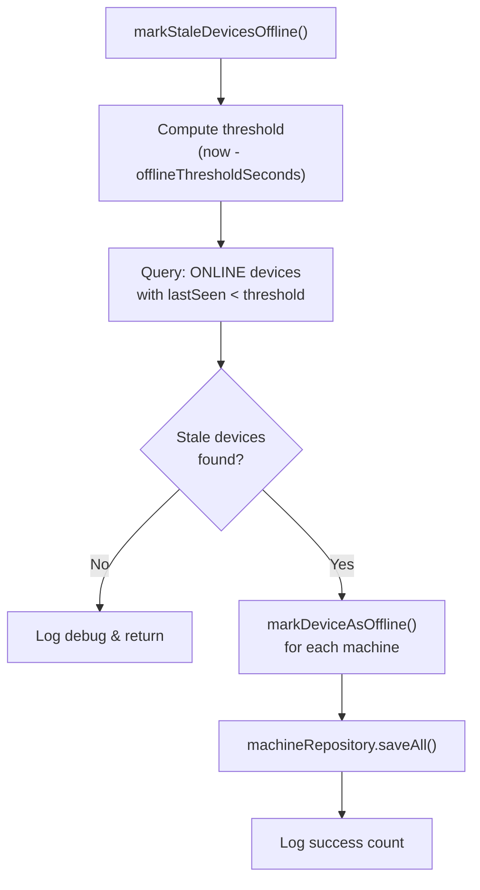

<!-- source-hash: 16ac7370888400637a03b9fc2983471c -->
Detects and marks devices as offline when they haven't sent a heartbeat within a configurable time threshold.

## Key Components

| Component | Description |
|-----------|-------------|
| `markStaleDevicesOffline()` | Public method that queries for stale online devices and bulk-updates their status to `OFFLINE` |
| `markDeviceAsOffline(Machine)` | Private helper that sets a single machine's status to `OFFLINE` and logs the transition |
| `offlineThresholdSeconds` | Configurable threshold (default: `130s`) via `openframe.device.heartbeat.offline-threshold-seconds` |
| `MachineRepository` | Repository dependency used to query stale devices and persist status changes |

## Usage Example

```java
// Typically invoked on a scheduled basis, e.g. via a @Scheduled task
@Scheduled(fixedDelayString = "${openframe.device.heartbeat.check-interval-ms:60000}")
public void runHeartbeatCheck() {
    deviceHeartbeatOfflineDetectionService.markStaleDevicesOffline();
}
```

> **Configuration:** Override the default 130-second threshold in `application.properties`:
> ```text
> openframe.device.heartbeat.offline-threshold-seconds=90
> ```

## Flow

