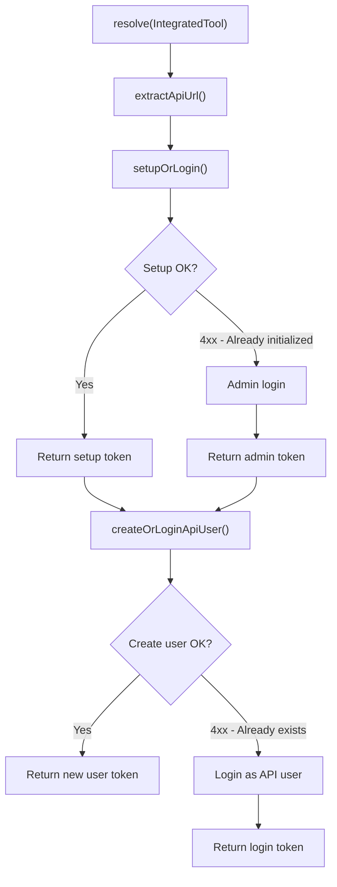

<!-- source-hash: 7043517b33a13b851df46dcd485f275d -->
Resolves a Fleet MDM API key for an integrated tool by handling initial setup, admin login, and API-only service user creation or login flows.

## Key Components

| Member | Type | Description |
|---|---|---|
| `API_USER_NAME` | Constant | Display name for the API service user (`"API Service User"`) |
| `API_USER_ROLE` | Constant | Role assigned to the API user (`"admin"`) |
| `resolve(IntegratedTool)` | Public method | Entry point — returns a valid API token for the given tool |
| `extractApiUrl(IntegratedTool)` | Private method | Extracts the API URL (with optional port) from the tool's configured URLs |
| `setupOrLogin(...)` | Private method | Attempts Fleet initial setup; falls back to admin login if already initialized |
| `createOrLoginApiUser(...)` | Private method | Creates an API-only service user; falls back to login if user already exists |

## Usage Example

```java
@Service
@RequiredArgsConstructor
public class FleetIntegrationService {

    private final FleetApiKeyResolver fleetApiKeyResolver;
    private final IntegratedToolRepository toolRepository;

    public String getFleetApiToken(String toolId) {
        IntegratedTool tool = toolRepository.findById(toolId)
                .orElseThrow(() -> new IllegalArgumentException("Tool not found: " + toolId));

        // Resolves setup → admin login → API user creation/login automatically
        return fleetApiKeyResolver.resolve(tool);
    }
}
```

## Flow



> **Note:** All 4xx HTTP errors during setup or user creation are treated as idempotent conditions — the resolver gracefully falls back to login rather than failing. Non-4xx errors are re-thrown.