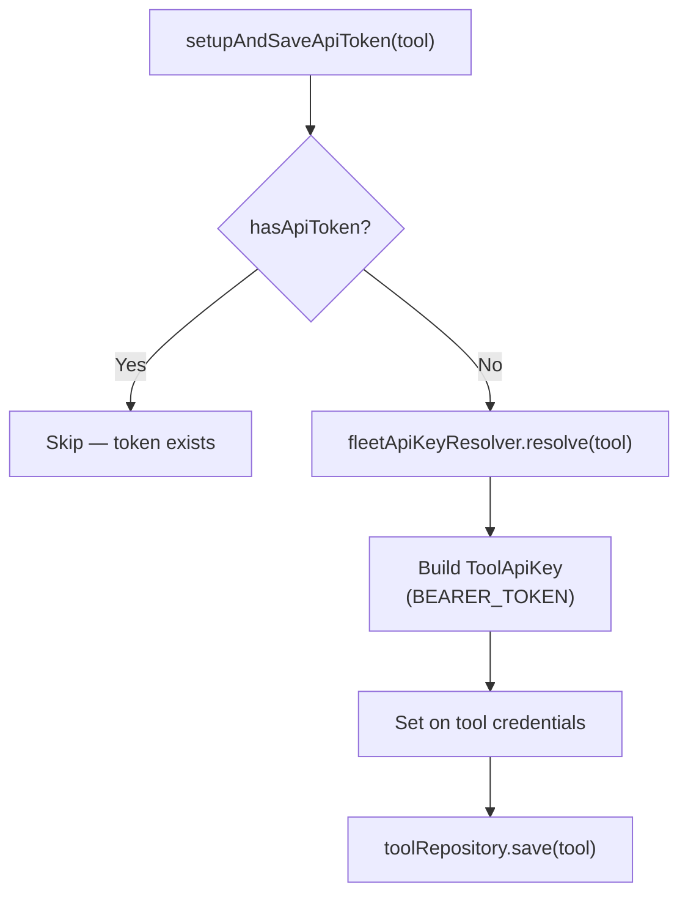

<!-- source-hash: 427defb341ec7c60f80cabcb8f0895c8 -->
Handles the one-time setup of a Fleet MDM API token for an `IntegratedTool`, resolving and persisting a bearer token if one is not already configured.

## Key Components

| Member | Type | Description |
|--------|------|-------------|
| `FLEET_API_TOKEN_KEY_NAME` | Constant | Display name used when storing the API key (`"Fleet API Token"`) |
| `fleetApiKeyResolver` | Dependency | Resolves the actual bearer token value from the tool configuration |
| `toolRepository` | Dependency | Persists the updated `IntegratedTool` document |
| `setupAndSaveApiToken(IntegratedTool)` | Public method | Entry point — skips setup if a token already exists, otherwise resolves, builds, and saves the `ToolApiKey` |
| `hasApiToken(IntegratedTool)` | Private method | Null-safe check that walks `credentials → apiKey → key` and returns `true` only if a non-empty key is present |

## Usage Example

```java
// Typically called during Fleet MDM tool onboarding or re-registration
IntegratedTool fleetTool = toolRepository.findById(toolId).orElseThrow();

fleetMdmSetupService.setupAndSaveApiToken(fleetTool);
// If no token existed, fleetTool now has a BEARER_TOKEN credential saved
// If a token was already present, the call is a no-op
```

## Flow



> **Note:** The service is idempotent — calling it multiple times on the same tool is safe, as it exits early if a token is already stored.