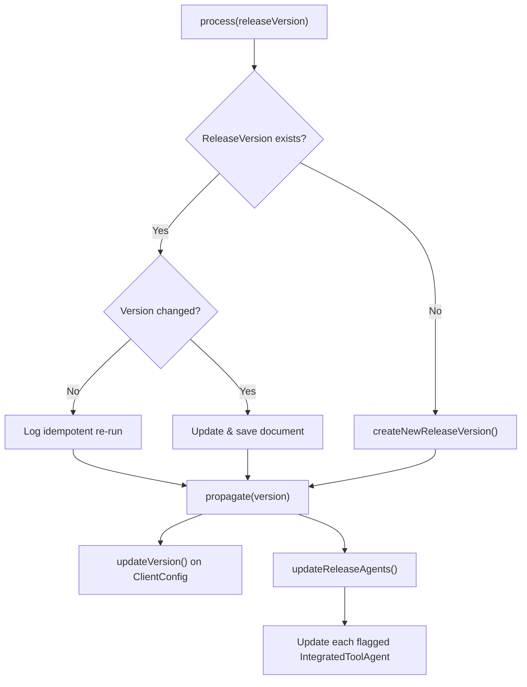

<!-- source-hash: 35a044fb29d6bb36ec575d3a190a4bb1 -->
Manages the lifecycle of OpenFrame platform release versions, handling creation, update, and propagation of version information across client configurations and integrated tool agents.

## Key Components

| Member | Type | Description |
|--------|------|-------------|
| `process(String releaseVersion)` | `@RetryOnOptimisticLockingFailure` method | Entry point — upserts the release version record and triggers propagation |
| `updateExistingReleaseVersion(...)` | Private method | Updates an existing `ReleaseVersion` document if the version has changed; propagates regardless for idempotency |
| `createNewReleaseVersion(...)` | Private method | Creates the initial `ReleaseVersion` document when none exists |
| `propagate(String version)` | Private method | Fans out the new version to client configurations and all release-flagged tool agents |
| `updateReleaseAgents(String version)` | Private method | Fetches all `IntegratedToolAgent` records where `releaseVersion=true` and updates each to the new version |

## Usage Example

```java
// Injected via Spring context
@Autowired
private ReleaseVersionService releaseVersionService;

// Called during a deployment pipeline or version sync event
releaseVersionService.process("2.14.0");

// Internally, the service will:
// 1. Upsert the ReleaseVersion document in the repository
// 2. Push the new version to OpenFrameClientConfigurationService
// 3. Update all IntegratedToolAgents flagged as release agents
```

## Flow



> **Note:** `process()` is annotated with `@RetryOnOptimisticLockingFailure` to safely handle concurrent version update conflicts at the database layer.