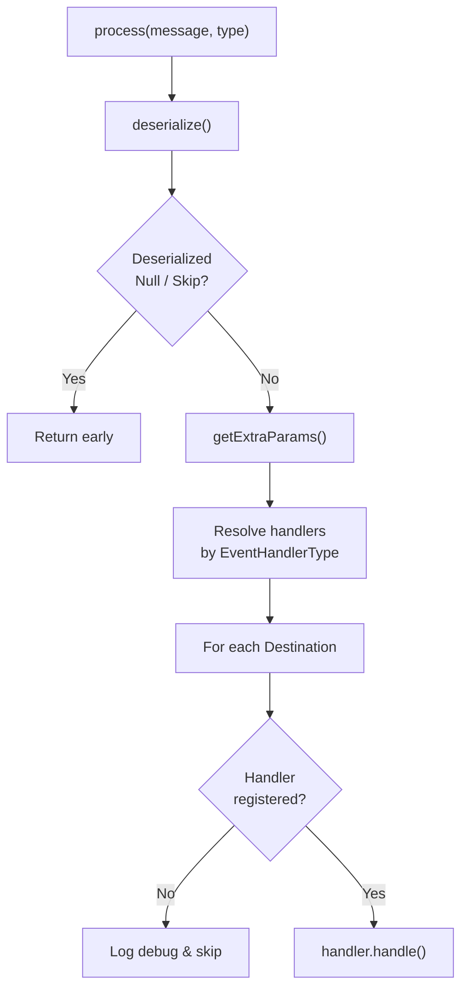

<!-- source-hash: a6fdbea34331df1da6ce08c9c564cba8 -->
Orchestrates the processing pipeline for generic JSON Kafka/Debezium messages by coordinating deserialization, data enrichment, and routing to registered destination handlers.

## Key Components

| Component | Type | Description |
|---|---|---|
| `GenericJsonMessageProcessor` | `@Service` | Core processor wiring deserializers, enrichment services, and handlers |
| `handlers` | `Map<EventHandlerType, Map<Destination, MessageHandler>>` | Two-level map routing by event type then destination |
| `dataEnrichmentServices` | `Map<DataEnrichmentServiceType, DataEnrichmentService>` | Enrichment services indexed by type |
| `deserializers` | `Map<MessageType, KafkaMessageDeserializer>` | Deserializer registry keyed by message type |
| `process()` | Method | Entry point: deserializes, enriches, and fans out to all configured destinations |
| `deserialize()` | Private | Resolves and invokes the correct `KafkaMessageDeserializer`; throws if type unsupported |
| `getExtraParams()` | Private | Fetches enriched data from the appropriate `DataEnrichmentService` |

## Usage Example

```java
// Spring auto-wires all MessageHandler, DataEnrichmentService,
// and KafkaMessageDeserializer beans via constructor injection

@Autowired
GenericJsonMessageProcessor processor;

// Called from a Kafka consumer listener
CommonDebeziumMessage inboundMessage = ...; // raw Debezium event
processor.process(inboundMessage, MessageType.DEVICE_UPSERT);

// Processing steps (internal):
// 1. Deserialize  → DeserializedDebeziumMessage
// 2. Enrich       → IntegratedToolEnrichedData
// 3. Fan-out      → handler.handle() for each configured Destination
```

## Processing Flow



> **Note:** If no handler is registered for a given `Destination`, the processor logs at `DEBUG` level and silently skips that destination — allowing partial routing without failing the entire pipeline.