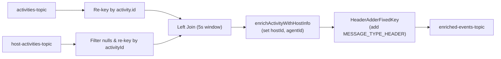

<!-- source-hash: 6395a2ec6b2687c736f75b43161469f8 -->
A Kafka Streams service that enriches Fleet MDM activity events by performing a windowed left-join between activity records and host activity records, then routes the enriched output to a downstream topic with appropriate message type headers.

## Key Components

| Component | Description |
|-----------|-------------|
| `buildActivityEnrichmentStream` | `@Bean` method that constructs the Kafka Streams topology — reads from two input topics, joins them, adds headers, and writes to the output topic |
| `enrichActivityWithHostInfo` | Join value joiner that merges `HostActivity` data (hostId, agentId) into an `ActivityMessage` |
| `HeaderAdderFixedKey` | Inner `FixedKeyProcessor` that appends `MESSAGE_TYPE_HEADER` and `__TypeId__` Kafka headers to each outgoing record |
| `resolveMessageType` | Classifies messages as `FLEET_MDM_POLICY_ACTIVITY_EVENT` or `FLEET_MDM_EVENT` based on `activityType` |
| `JOIN_WINDOW_DURATION` | 5-second tumbling join window (no grace period) used for the left-join |
| `POLICY_ACTIVITY_TYPES` | Static set of activity type strings that trigger the policy-specific message type classification |

## Usage Example

```java
// The stream topology is auto-wired by Spring via @Bean.
// Required configuration in application.yml:

// kafka.stream.enabled: true  (or omit; matchIfMissing = true)
//
// openframe.oss-tenant.kafka.topics.inbound:
//   fleet-mdm-activities.name:      activities-topic
//   fleet-mdm-host-activities.name: host-activities-topic
//   fleet-mdm-events.name:          enriched-events-topic

// The service automatically:
// 1. Reads ActivityMessage records from activities-topic
// 2. Re-keys them by activity ID
// 3. Left-joins with HostActivityMessage records within a 5s window
// 4. Enriches the activity with hostId / agentId
// 5. Adds MESSAGE_TYPE_HEADER based on activityType
// 6. Publishes to enriched-events-topic
```

## Stream Topology

