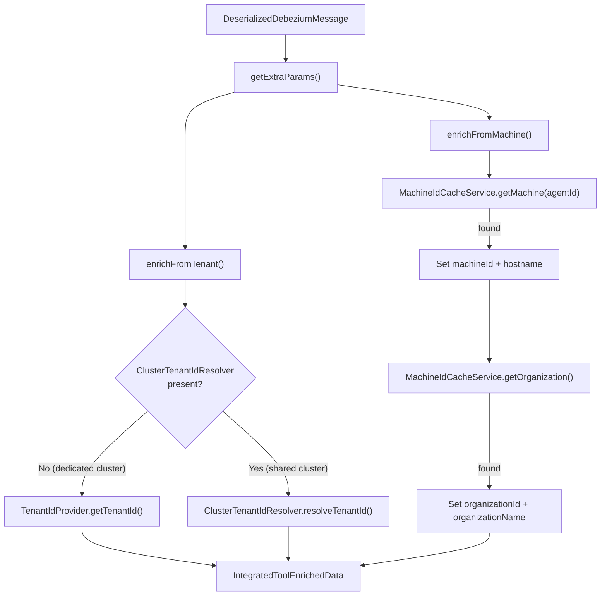

<!-- source-hash: 8e06947ef80122a0a9b1bfee3330c5d4 -->
Enriches deserialized Debezium messages from integrated tools with machine, organization, and tenant context by resolving cached data before downstream processing.

## Key Components

| Member | Type | Description |
|--------|------|-------------|
| `getExtraParams()` | Method | Entry point that orchestrates enrichment, returning an `IntegratedToolEnrichedData` object |
| `enrichFromMachine()` | Method | Resolves `machineId`, `hostname`, `organizationId`, and `organizationName` from Redis cache via `MachineIdCacheService` using the message's `agentId` |
| `enrichFromTenant()` | Method | Resolves `tenantId` — uses `TenantIdProvider` for single-tenant clusters, or `ClusterTenantIdResolver` for shared/multi-tenant clusters |
| `getType()` | Method | Identifies this service as `INTEGRATED_TOOLS_EVENTS` for the `DataEnrichmentService` registry |
| `clusterTenantIdResolver` | Dependency | Optional bean (`required = false`) — absent on dedicated tenant clusters, present on shared clusters (e.g., MeshCentral domain mapping) |

## Usage Example

```java
// Typically invoked by a stream processor after Debezium deserialization
DeserializedDebeziumMessage message = debeziumDeserializer.deserialize(record);

IntegratedToolEnrichedData enriched = enrichmentService.getExtraParams(message);

// enriched now carries resolved context
log.info("Processing event for tenant={} machine={} org={}",
    enriched.getTenantId(),
    enriched.getMachineId(),
    enriched.getOrganizationName()
);
```

## Enrichment Flow

