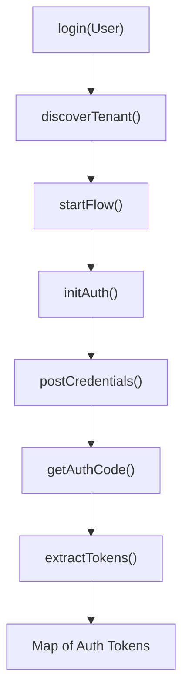

<!-- source-hash: 67381708e07a9be390a645dd32161058 -->
Provides a unified authentication entry point that delegates to the appropriate authentication flow implementation based on the current environment mode (OSS or SaaS).

## Key Components

| Component | Description |
|-----------|-------------|
| `login(User user)` | Static method that orchestrates the full authentication flow and returns a map of auth tokens |
| `IAuthFlow` | Interface abstraction used to support both OSS and SaaS auth strategies |
| `AuthFlowOSS` | OSS-specific authentication flow implementation |
| `AuthFlowSAAS` | SaaS-specific authentication flow implementation |

## Flow Steps

The authentication chain executes the following steps sequentially:



## Usage Example

```java
// Authenticate a user and retrieve tokens
User user = new User("admin@example.com", "password123");
Map<String, String> tokens = AuthFlow.login(user);

String accessToken = tokens.get("access_token");
String refreshToken = tokens.get("refresh_token");
```

## Environment Routing

The flow is selected at runtime based on `EnvironmentConfig.getEnvMode()`:

| Mode | Implementation |
|------|---------------|
| `OSS` | `AuthFlowOSS` |
| SaaS | `AuthFlowSAAS` |