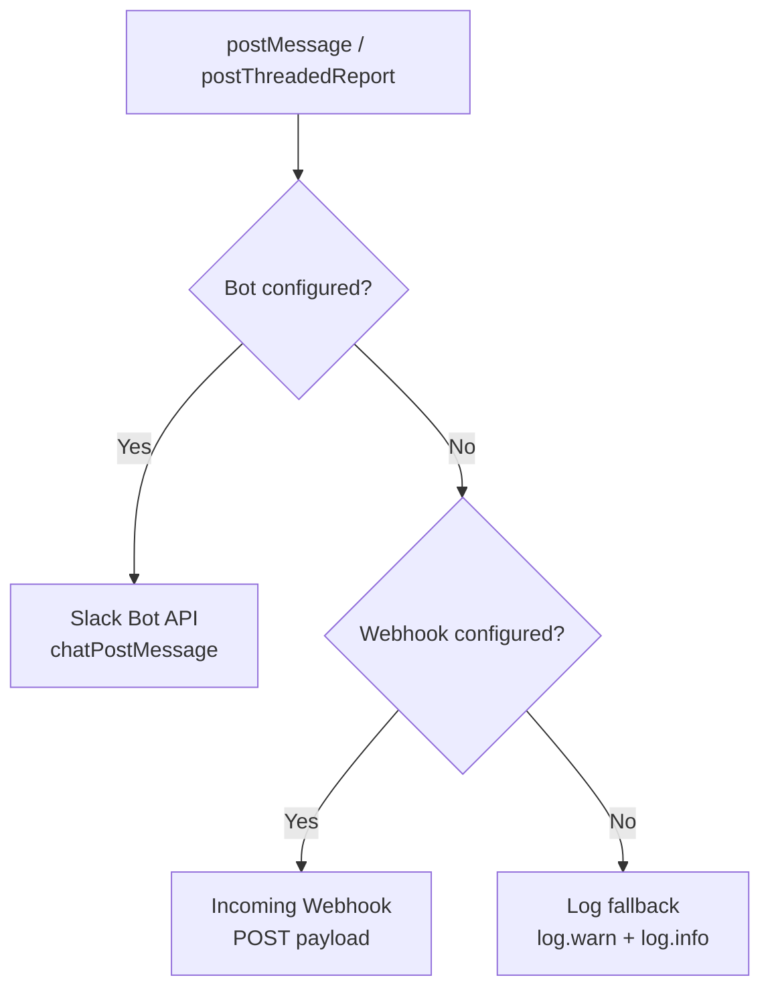

<!-- source-hash: edc8557c537eb8a8dc6884860904f12a -->
Slack notification client that supports sending messages and threaded reports via Slack Bot API or Incoming Webhooks, with fallback logging when neither is configured.

## Key Components

| Member | Description |
|--------|-------------|
| `SlackClient(String, String, String)` | Full constructor with bot token, channel ID, and webhook URL |
| `SlackClient(String, String)` | Bot-only constructor |
| `SlackClient(String)` | Webhook-only constructor |
| `postMessage(String)` | Sends a single message via bot, webhook, or log fallback |
| `postThreadedReport(String, String)` | Posts a summary with chunked details as thread replies (bot) or concatenated messages (webhook) |
| `splitIntoChunks(String, int)` | Splits large text into line-aware chunks capped at 3,000 characters |
| `isBotConfigured()` / `isWebhookConfigured()` | Guards that determine which delivery method is used |

## Delivery Priority



## Usage Example

```java
// Bot API (supports true threading)
SlackClient bot = new SlackClient("xoxb-token", "C01234567");
bot.postMessage("Deployment started");
bot.postThreadedReport("✅ Test Run Complete", detailedReport);

// Webhook (no threading; chunks sent as sequential messages)
SlackClient webhook = new SlackClient("https://hooks.slack.com/services/...");
webhook.postThreadedReport("⚠️ Failures detected", longDetails);

// No config (logs only — safe for local dev)
SlackClient noop = new SlackClient(null, null, null);
noop.postMessage("This will be logged, not sent");
```

> **Note:** When using the bot token path, `postThreadedReport` posts the summary as the parent message and each 3,000-character chunk as a reply in the same thread. Webhook mode does not support threading and concatenates all content before chunking.