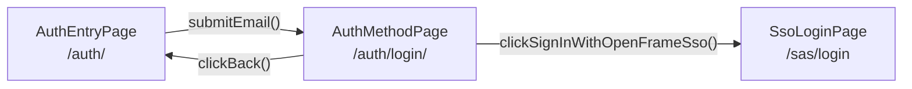

<!-- source-hash: 96c19eb1a563645e8b61b3ce3eb54c16 -->
Page Object Model class representing Step 2 of the OpenFrame authentication flow — the provider selection screen displayed after email submission.

## Key Components

| Member | Type | Description |
|--------|------|-------------|
| `URL` | `static final String` | Canonical URL for this auth step (`https://openframe.build/auth/login/`) |
| `heading()` | Locator | "Already registered" `<h1>` heading |
| `ssoButton()` | Locator | "Sign in with OpenFrame SSO" button |
| `microsoftButton()` | Locator | "Continue with Microsoft" button |
| `googleButton()` | Locator | "Continue with Google" button |
| `backButton()` | Locator | "Back" navigation button |
| `clickSignInWithOpenFrameSso()` | Action | Clicks SSO button, waits for `/sas/login`, returns `SsoLoginPage` |
| `clickBack()` | Action | Clicks Back, waits for `/auth/`, returns `AuthEntryPage` |

## Usage Example

```java
// Assumes Step 1 (AuthEntryPage) has already submitted a valid email
AuthEntryPage entryPage = new AuthEntryPage(page);
AuthMethodPage methodPage = entryPage.submitEmail("user@example.com");

// Assert the provider picker is visible
assertThat(methodPage.heading()).isVisible();

// Navigate via OpenFrame SSO
SsoLoginPage ssoPage = methodPage.clickSignInWithOpenFrameSso();

// Or go back to re-enter email
AuthEntryPage backToEntry = methodPage.clickBack();
```

## Flow Position



> Each action method returns a typed Page Object, enabling fluent, type-safe test chains through the Playwright-based POM hierarchy.