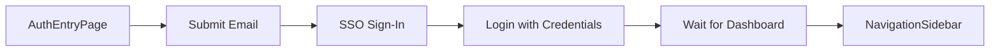

<!-- source-hash: 429d8fe9898e667bdec964bbbcf53c87 -->
Orchestrates the end-to-end UI login flow for the OpenFrame platform using Playwright, chaining page object interactions from authentication entry through dashboard load.

## Key Components

| Component | Description |
|-----------|-------------|
| `UILoginFlow(Page page)` | Constructor accepting a Playwright `Page` instance |
| `login(String email, String password)` | Executes the full SSO login sequence and returns a `NavigationSidebar` |

## Flow Sequence



## Usage Example

```java
// Instantiate with a Playwright Page and perform login
UILoginFlow loginFlow = new UILoginFlow(playwrightPage);
NavigationSidebar sidebar = loginFlow.login("technician@example.com", "securePassword");

// Continue test interactions via the returned sidebar
sidebar.navigateTo("Tickets");
```

## Key Behaviors

- **Page chaining**: Uses the Page Object Model (POM) pattern — each step returns the next page object, enabling fluent method chaining.
- **SSO integration**: Specifically invokes `clickSignInWithOpenFrameSso()`, targeting OpenFrame's SSO authentication path.
- **Load guard**: Calls `page.waitForCondition(dashboardPage::isLoaded)` before returning, ensuring the dashboard is fully rendered before test execution continues.
- **Returns sidebar**: Hands off a `NavigationSidebar` instance, allowing downstream tests to immediately interact with the authenticated UI.