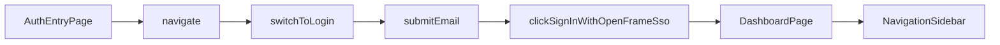

<!-- source-hash: 71f28cc5a609422457d7c70561dfaf54 -->
Orchestrates the end-to-end UI login flow for OpenFrame by chaining page object interactions from the authentication entry point through to a fully loaded dashboard session.

## Key Components

| Component | Description |
|---|---|
| `UILoginFlow(Page page)` | Constructor accepting a Playwright `Page` instance |
| `login(String email, String password)` | Executes the full login sequence and returns a ready `NavigationSidebar` |

## Usage Example

```java
// Initialize Playwright and create a browser page
UILoginFlow loginFlow = new UILoginFlow(page);

// Perform login and receive the post-auth navigation sidebar
NavigationSidebar sidebar = loginFlow.login("user@example.com", "s3cur3P@ss");

// Continue test interactions via the sidebar
sidebar.navigateTo("Dashboard");
```

## Login Sequence

The `login` method chains the following page transitions:


```mermaid
graph LR
    A[AuthEntryPage] --> B[navigate]
    B --> C[switchToLogin]
    C --> D[submitEmail]
    D --> E[clickSignInWithOpenFrameSso]
    E --> F[DashboardPage]
    F --> G[NavigationSidebar]
```

1. Navigates to `AuthEntryPage`
2. Switches to the login form
3. Submits the provided email
4. Triggers SSO sign-in via OpenFrame
5. Completes credential entry on the SSO page
6. Waits for `DashboardPage` to fully load
7. Returns a `NavigationSidebar` for continued test interaction

## Source

[`UILoginFlow.java`](https://github.com/flamingo-stack/openframe-oss-lib/blob/main/com/openframe/test/pages/flow/UILoginFlow.java)