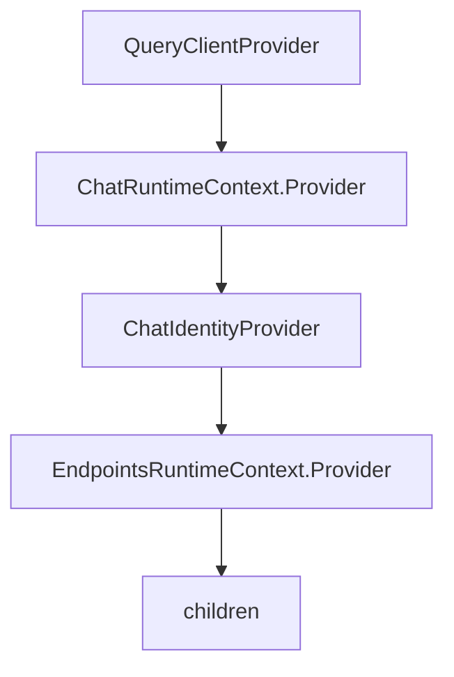

<!-- source-hash: bce3767f28d61a959ac8f45710a801ae -->
Sets up the root React provider tree for the OpenFrame embed, wiring together React Query, chat/endpoints runtime contexts, and a shared identity resolver to prevent duplicate `/identity` fetches across subtrees.

## Key Components

| Export | Type | Purpose |
|--------|------|---------|
| `AppProviders` | React component | Root wrapper that composes all runtime providers |
| `queryClient` | `QueryClient` | Singleton React Query client shared across the embed |
| `chatRuntime` | Memoized runtime | Built once via `buildChatRuntime`, injected into `ChatRuntimeContext` |
| `endpointsRuntime` | Memoized runtime | Built once via `buildEndpointsRuntime`, injected into `EndpointsRuntimeContext` |

## Provider Tree Order



The nesting order is intentional:
- `ChatIdentityProvider` sits **inside** `ChatRuntimeContext` (needs `identityUrl` from it) and **above** `EndpointsRuntimeContext`, so chat, tickets, and contact form all share a single `/identity` fetch.

## Usage Example

```typescript
// main.tsx or index.tsx
import { AppProviders } from './app-providers'
import { AppShell } from './app-shell'

createRoot(document.getElementById('root')!).render(
  <AppProviders>
    <AppShell />
  </AppProviders>
)
```

## Notes

- **Theme**: No `ThemeProvider` is mounted here — dark mode is applied via `data-theme="dark"` on `<html>` in `index.html`, since ODS tokens key off that attribute directly.
- **Runtimes are memoized** with an empty dependency array (`[]`) per the embedder warning in `@flamingo-stack/openframe-frontend-core`.